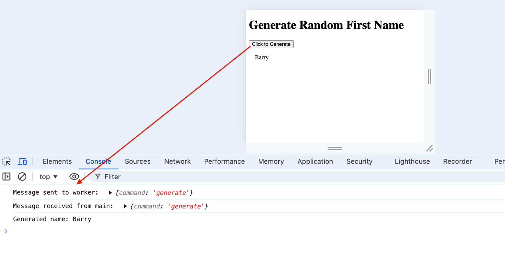

# Random First Name Generator
To practice building a dedicated worker.

https://jasheloper.github.io/random-name-gen/

Notes below for learning purposes.

<br>

## Main file: `main.js`

- The worker is created here using the `Worker()` constructor where the path containing the script is passed.

```
const worker = new Worker("name-worker.js");
```

- A click event is set up on the button, which will handle sending a message to the worker.

    - The message sent will be an object containing:

    ```
    {command: "generate"}
    ```

- The functionality for 'generate' will be defined in the worker script via a conditional statement (more on that below).


<br>
<br>


## Dedicated worker file: `name-worker.js`

- This is where the program's functionality lives (generating a random name).

- The worker will listen for the message from the main script.

- Once the message is received, a conditional is set up to check for `command = generate` in the message data, and if this is the case, the worker script will run and the result (the name) is sent back to the main file via a message.

```
addEventListener("message", (message) => {
  if(message.data.command === "generate") {
    const generatedName = nameGen(firstNames);
     postMessage(generatedName);
  }
});
```


<br>
<br>


## Finally

`main.js` will listen for the message sent back from the worker and this event will handle outputting the result in the browser.

```
output.textContent = message.data;
```

<br>

With this approach, the files are sending data back and forth using messages without having direct access to each other's variables.

<br>


*extra logging added to the code for learning purposes*